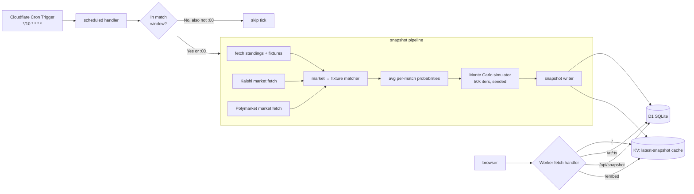

# IPL Playoff Probability Tracker

## Enhancement Summary

**Deepened on:** 2026-05-18 (same day as initial plan)
**Agents run in parallel:** architecture-strategist, code-simplicity-reviewer, data-integrity-guardian, performance-oracle, security-sentinel, kieran-typescript-reviewer, pattern-recognition-specialist, deployment-verification-agent, two best-practices-researchers (Monte Carlo, time-travel UX), two framework-docs-researchers (Hono on Workers, D1 + Cron), plus the `frontend-design` skill.

### Key Improvements (high-impact changes the deepening produced)

1. **PRNG swap (correctness).** Original plan used `mulberry32` (2³² period). For 50K iterations × ~40 matches = 2M+ draws, that period is uncomfortably close. Switch to **`sfc32`** — 128-bit state, passes PractRand + BigCrush, ~30% slower (irrelevant at this scale).
2. **Iteration count cut (efficiency).** 50K → **25K** Monte Carlo iterations. Wilson 95% CI at p=0.5, N=25K is ±0.62pp — comfortably under 1-decimal display rounding. Halves CPU.
3. **Common Random Numbers (variance reduction).** Pre-assign each remaining match a fixed slot in the RNG stream so probability deltas between snapshots reflect *input change*, not RNG noise. Single largest UX win for time-travel coherence.
4. **Data model simplified.** Drop `current_snapshot_ref` table (use `ORDER BY taken_at_utc DESC LIMIT 1` on indexed column instead). Add `snapshots.payload_json` for read-path efficiency. Reconsider whether the 11-table denormalized schema is needed at all (see "Decisions Pending" below — simplicity reviewer made a strong case for collapsing to 3 tables + JSON blob).
5. **D1 atomicity clarified.** D1 has no `BEGIN/COMMIT`. Use a single `db.batch([...])` containing every insert + the final `current_snapshot_ref` update (if kept) OR set `committed_at` last. Add `committed_at` column; readers filter `WHERE committed_at IS NOT NULL` to skip partial writes.
6. **Typography pushback (frontend-design skill).** Inter is the most-overused font in AI-generated UIs. Demote Inter to body fallback; pair with **Fraunces** (variable serif, sports-section gravitas) or **Bricolage Grotesque** for display/team names. Use `font-feature-settings: "tnum" 1` on numbers.
7. **The memorable design move.** CSS row-bar: each row's background uses `linear-gradient(...)` whose width is set by an inline `--p-playoffs` custom property. Zero JS. This is the screenshot moment that differentiates the page from a generic AI table.
8. **Time-travel picker redesign.** Wayback-style day-strip + hour-list, not a continuous slider. Quick-pills (`Now / 1h ago / Yesterday's final / Custom`) above the picker cover 80% of cases in one tap. Sticky top banner + sepia tint on past data; `@view-transition { navigation: auto; }` for smooth crossfades.
9. **Backfill runs from local Node, not from a Worker.** Avoids the 30s CPU cap; lets you parallelize Kalshi+Polymarket fetches at 10–20 concurrent. Realistic time: 10–15 min parallelized (the original "30 min serially" estimate was optimistic).
10. **Hono on Workers idioms.** `hono/jsx` + `jsxRenderer` middleware, Workers **Assets binding** for static (not KV), `@cloudflare/vitest-pool-workers` for testing with real D1/KV. `satisfies ExportedHandler<Bindings>` for both `fetch` and `scheduled`.
11. **Security tightening.** All `:ts` route params validated with strict regex `^\d{4}-\d{2}-\d{2}(T\d{2}:\d{2}(:\d{2})?Z)?$` (DoS protection). SHA256-hashed OG cache keys. Cloudflare Rate Limiting Rules (60 req/min/IP) on `/at/*` and `/api/*`. CSP `frame-ancestors *` on `/embed` only, `'none'` elsewhere. Mandate `db.prepare(...).bind(...)` everywhere with a CI grep gate.
12. **TypeScript discipline.** Branded types for `TeamCode`, `FixtureId`, `SnapshotId`, `IsoUtc`, `Probability`. Zod runtime validation at every external-API boundary. Result types at I/O boundaries; throws only for bugs. `Promise.allSettled` (not `Promise.all`) for client fan-out. `date-fns-tz` for IST↔UTC.

### New Considerations Surfaced

- **Tie-break versioning** — store `tiebreak_algorithm_version` on `snapshots` so historical `/at/*` pages use the algorithm that produced them, not the current one.
- **Schema evolution and time-travel** — `schema_version` on snapshots needs an actual read-time dispatch, not just metadata.
- **NRR approximation refinement** — instead of a random walk, **bootstrap from this season's observed match margins** (conditioned on win/loss). More defensible.
- **Resolved-market reconciliation** — if either Kalshi or Polymarket marks a market resolved, treat that as authoritative (P=0/1) and ignore the other venue's live quote on that market.
- **Read replicas via D1 Sessions API.** Available in 2026; use `env.DB.withSession()` on the public `fetch` path with a KV-stored bookmark for monotonic reads.
- **D1 cron failure** — Workers does NOT auto-retry failed `scheduled` invocations. Idempotency must be built in (deterministic snapshot IDs from `hash(taken_at_utc)`).
- **Gap detection in time-travel** — render a staleness banner on `/at/*` (not just `/`) when the served snapshot is more than 2× the expected interval older than the requested timestamp.

### Reviewer Disagreements (all resolved)

All three reviewer disagreements surfaced during deepening have been resolved with the user (see "Decisions Resolved" section near the end of this document):

- **Simplicity vs structure.** Resolved → **hybrid** (canonical rows + `payload_json`).
- **Typography.** Resolved → **Inter for the table, Fraunces for hero/dateline**.
- **Bradley-Terry strength model.** Resolved → **cut for v1, stub the interface**.

One user override of a recommended default:

- **OG image generation.** Recommendation was "defer to v2; static PNG for launch." User chose **dynamic Satori from day one** — pulls OG work forward from Phase C into Phase B.

## Overview

A public, Cricbuzz-styled web page that shows live and historical probabilities for each of the ten IPL 2026 teams across three outcomes: making the playoffs (top 4), finishing in the top 2 (Qualifier 1 advantage), and winning the final. Probabilities are computed via Monte Carlo simulation seeded from per-match win probabilities, which are in turn the average of Kalshi and Polymarket market-implied prices for the corresponding fixtures. Snapshots are persisted on every refresh so the page can be rendered as it appeared at any past timestamp.

This document is a *plan*, not implementation. It captures architecture, schema, sequencing, open decisions, and risks so the build can start with high confidence.

## Problem Statement / Motivation

**For whom:** cricket fans following the IPL playoff race, plus a downstream goal of pitching an embed to Cricbuzz.

**Why this matters:** Cricbuzz's points table tells you *who is winning*; nothing on it tells you *what each team's path looks like from here*. Prediction markets price these outcomes well but are unfamiliar to the average IPL fan, fragmented across two venues, and not framed around playoff scenarios. Aggregating both venues and lifting the answer up to a fan-friendly "playoff odds" frame is the value.

**Why now:** It is May 18, 2026. The league stage ends ~May 24; only one week of regular-season games remain, and the playoff race is wide open (positions 2–8 are all live). Shipping in the next 5–7 days captures the moment when interest peaks.

**Why averaging two venues:** Kalshi and Polymarket draw different liquidity pools — Kalshi is US retail (CFTC-regulated), Polymarket is global crypto. Averaging hedges against thin-market noise on either side and produces a more defensible single number. Both venues' implied IPL champion markets exist and are deep enough to be useful (Polymarket champion event has ~$1.3M volume; Kalshi champion event has active two-way trading).

## Proposed Solution

A single Cloudflare Workers app that does four things on a cron-driven loop:

1. **Pulls fixtures and current standings** from a cricket data source.
2. **Pulls market prices** from Kalshi (`KXIPLGAME-*` per-match and `KXIPL-26-*` champion markets) and Polymarket (`cricipl-*` per-match and `2026-ipl-champion` champion markets), then averages them per fixture and per team.
3. **Runs a seeded Monte Carlo simulation** (50,000 iterations) over the remaining schedule + playoff bracket, producing P(playoffs), P(top 2), P(champion) for each team.
4. **Writes a timestamped snapshot** to D1 (SQLite). The web routes read the latest snapshot for `/` and any past snapshot for `/at/<timestamp>`.

The page itself is server-rendered HTML using Hono on Workers (lightweight, fast cold-start, no React/Next bundle for an MVP). It serves a prominent probability table styled to match Cricbuzz's visual language — green primary (`#009270`), dark charcoal table headers (`#212121`), Inter typography, alternating row stripes — plus a direct-market champion-odds row beneath for transparency and a date picker for time travel.

## Technical Approach

### Architecture



#### Research Insights — Architecture

From the architecture-strategist review (concrete deltas to apply during Phase 1):

- **Split `probability-aggregator` into pure averager + `confidence-scorer`.** Averaging prices and computing confidence flags are two cohesive jobs, currently fused. Mixing them invites drift between `match_odds.disagreement_pp` and `match_odds.confidence`.
- **Drop `current_snapshot_ref`.** Three sources of truth for "latest" (D1 table + a one-row pointer + KV cache) is overkill at this scale. An indexed `SELECT * FROM snapshots ORDER BY taken_at_utc DESC LIMIT 1` is sub-millisecond and removes a class of three-place-update bugs. Keep KV only if measured D1 latency exceeds 50ms p99.
- **Move KV cache invalidation OUT of the snapshot-writer's critical path.** D1 commit first; `ctx.waitUntil(env.KV.put(...))` second. Never let KV failure abort the snapshot.
- **`Promise.allSettled`, not `Promise.all`.** One venue failing must not abort the snapshot. Codify as an architectural rule: *the writer never partial-writes — if any required input is missing, log a `snapshot_warnings` row at `error` level and return without touching `match_odds`/`team_probabilities`.*
- **Add `snapshots.payload_json` for read-path efficiency.** Render-path cost on `/at/:ts` is ~84 row reads (10 teams × probabilities + 74 fixtures × odds). One JSON blob deserializes in one read. Write both in the same `db.batch()` — canonical rows for analytics, blob for renderer.
- **`/embed` stays a separate route.** A query-param toggle on `/` conflates cache keys and risks accidentally leaking the picker into iframes. Set `Content-Security-Policy: frame-ancestors *` on `/embed` only; `'none'` everywhere else.

**Component responsibilities:**

| Component | Responsibility | Idempotent? |
|---|---|---|
| `cron-handler` | Decide whether to run a snapshot this tick; orchestrate the pipeline | yes |
| `cricket-data-client` | Fetch fixtures + standings; normalize team identifiers | yes |
| `kalshi-client` | Fetch `KXIPLGAME` + `KXIPL` markets; parse ticker → fixture key | yes |
| `polymarket-client` | Fetch `cricipl-*` per-match + `2026-ipl-champion` markets via Gamma; CLOB prices for tokens | yes |
| `market-matcher` | Join Kalshi + Polymarket markets to the canonical fixture rows | yes |
| `probability-aggregator` | Average venue prices per fixture; compute confidence flags (disagreement, low-volume) | yes |
| `monte-carlo` | Simulate remaining season + playoff bracket; deterministic seed | yes |
| `snapshot-writer` | Write atomic snapshot to D1; update `current_snapshot` pointer + KV cache | yes (snapshot UUID is content-hashed) |
| `web-router` | Hono routes for `/`, `/at/:ts`, `/api/snapshot`, `/embed`, `/og/:ts.png` | yes |
| `view-templates` | Cricbuzz-styled HTML + minimal inline CSS (no client JS for MVP) | n/a |

### Data Model (D1 / SQLite)

ERD:

```mermaid
erDiagram
    teams ||--o{ fixtures : "team_a"
    teams ||--o{ fixtures : "team_b"
    teams ||--o{ fixture_results : "winner"
    teams ||--o{ team_probabilities : ""
    teams ||--o{ champion_market_odds : ""
    snapshots ||--o{ match_odds : ""
    snapshots ||--o{ team_probabilities : ""
    snapshots ||--o{ champion_market_odds : ""
    snapshots ||--o{ snapshot_warnings : ""
    fixtures ||--o{ fixture_results : ""
    fixtures ||--o{ match_odds : ""

    teams {
        text code PK "3-letter, e.g. MI"
        text full_name "Mumbai Indians"
        text short_name "Mumbai"
        text primary_color_hex
        text kalshi_code "MI"
        text poly_short "mum"
    }
    fixtures {
        integer match_number PK
        text date_utc
        text venue
        text team_a_code FK
        text team_b_code FK
        text kalshi_game_ticker "nullable"
        text poly_event_slug "nullable"
        text status "scheduled | live | completed | abandoned"
    }
    fixture_results {
        integer match_number PK FK
        text winner_code FK "nullable for NR"
        integer margin_runs "nullable"
        integer margin_wickets "nullable"
        text completed_at_utc
    }
    snapshots {
        text id PK "uuid v7"
        text taken_at_utc
        text trigger "cron | manual | backfill"
        integer mc_iterations
        integer mc_seed
        text schema_version
    }
    match_odds {
        text snapshot_id FK
        integer match_number FK
        real kalshi_p_a "nullable"
        real kalshi_p_b "nullable"
        real poly_p_a "nullable"
        real poly_p_b "nullable"
        real avg_p_a
        real avg_p_b
        text sources_used "kalshi,polymarket,both,fallback-elo"
        real disagreement_pp "abs delta of kalshi_p_a vs poly_p_a"
        real combined_volume_usd
        text confidence "high | medium | low"
    }
    team_probabilities {
        text snapshot_id FK
        text team_code FK
        real p_playoffs
        real p_top2
        real p_champion
        real p_playoffs_ci_low
        real p_playoffs_ci_high
        integer simulated_wins_mean
        real simulated_nrr_mean
        real delta_p_playoffs_24h "for trend arrows"
    }
    champion_market_odds {
        text snapshot_id FK
        text team_code FK
        real kalshi_p "nullable"
        real poly_p "nullable"
        real avg_p
        real disagreement_pp
    }
    snapshot_warnings {
        text snapshot_id FK
        text level "info | warn | error"
        text code "unmapped_market | source_disagreement | api_failure | ..."
        text detail_json
    }
```

**Schema notes:**

- `teams` is seeded once at install time. `fixtures` is seeded once with the full 74-match league schedule + 4 playoff stubs (Q1/Eliminator/Q2/Final created as placeholders with `team_a_code = team_b_code = NULL` until determined). Both tables are append/update-on-known-truth.
- `snapshots.id` uses UUIDv7 for natural time ordering; `taken_at_utc` is duplicated for query convenience and time-range index.
- Every snapshot writes a full set of rows in `match_odds` (every remaining fixture) and `team_probabilities` (all 10 teams) — denormalized for query speed. Avoids JOIN gymnastics when rendering a historical page.
- `current_snapshot_ref(id=1, snapshot_id)` is a one-row table used as a fast pointer for `/`. Updated last in the snapshot transaction. **[Note: deepening recommends dropping this — see Research Insights below.]**
- Indexes: `snapshots(taken_at_utc)`, `match_odds(snapshot_id)`, `team_probabilities(snapshot_id, team_code)`. SQLite handles this volume trivially — a season's worth of 10-min snapshots is ~10,000 rows × 10 teams = 100K probability rows, well within D1's 5 GB free tier.

#### Research Insights — Data Model & Integrity

From the data-integrity-guardian review and Cloudflare D1 docs research:

- **D1 has no `BEGIN`/`COMMIT`/`SAVEPOINT`.** Only `db.batch([stmt1, stmt2, ...])` is transactional — all statements succeed or the whole batch rolls back. The snapshot writer MUST place every insert into a single `batch()` call. Cite: [D1 Worker API](https://developers.cloudflare.com/d1/worker-api/d1-database/).
- **Add `snapshots.committed_at` column** written last in the batch. Readers filter `WHERE committed_at IS NOT NULL` so a Worker killed mid-write can never surface partial state.
- **Resolve the UUIDv7 vs content-hash contradiction.** Keep UUIDv7 as `snapshots.id` (PK, time-ordered, dedupe-friendly index). Add a separate `content_hash` column with `UNIQUE` constraint; on `INSERT OR IGNORE` conflict, the dupe collapses. The 8-minute idempotency guard becomes belt-and-suspenders.
- **`PRAGMA foreign_keys = ON`** must be the first statement of every migration. D1 defaults this OFF per connection — currently every FK in the ERD is advisory only.
- **Tie-break versioning.** Add `snapshots.tiebreak_algorithm_version INTEGER` (and `snapshots.schema_version INTEGER`). When the algorithm changes in v2, historical `/at/*` pages must replay with the original algorithm — dispatch on the version in the renderer.
- **Resolved-market reconciliation rule.** If either Kalshi or Polymarket marks a market `resolved`/`settled`, treat that as authoritative truth (P=0 for NO, P=1 for YES) and ignore the other venue's live quote. Log a `source_disagreement` warning if the unresolved venue's ask is >2¢. Add `resolved_source` column to `champion_market_odds`.
- **Gap handling in time-travel.** "Latest snapshot ≤ requested timestamp" handles the before-first case but not gaps. If the served snapshot is older than 2× the expected cadence at that timestamp (>20 min during a match window, >2h otherwise), render a staleness banner ON the `/at/*` page (not just `/`). Do NOT interpolate probability values — that would create data that never existed.
- **D1 limits (free tier):** 5 GB total / 500 MB per DB / 5M rows-read / 100K rows-written per day / 50 queries per Worker invocation. A 10-minute cron writing ~85 rows per tick = 12,240 rows/day. Trivially under cap.
- **D1 Read Replication (2026).** Available via Dashboard or REST API (`read_replication.mode: auto`). Requires the Sessions API: `const session = env.DB.withSession("first-unconstrained")` for monotonic reads, or pass a bookmark string from a prior session. **Use it on the public `fetch` path** (latency win); keep `scheduled` writer on the primary binding.
- **Cron failure has no auto-retry.** `wrangler` logs the failure but the next run is the next scheduled tick. Use deterministic snapshot IDs (`uuidv7(taken_at_utc)`) with `INSERT OR IGNORE` so a manual re-trigger doesn't duplicate.
- **Migrations are forward-only.** No built-in rollback. For breaking changes use the expand/contract pattern: (1) add nullable column, (2) deploy writer that fills both, (3) backfill, (4) deploy reader on new column, (5) separate migration drops old column.
- **Backfill: skip empty hours, don't impute.** Kalshi candlesticks + Polymarket prices-history are not guaranteed dense. Write a `snapshot_warnings` row with `code=gap_reason` for any hour where data is missing rather than fabricating a snapshot.

References:
- [D1 Best Practices](https://developers.cloudflare.com/d1/best-practices/)
- [D1 Read Replication](https://developers.cloudflare.com/d1/best-practices/read-replication/)
- [D1 Migrations](https://developers.cloudflare.com/d1/reference/migrations/)

### Probability Engine

#### Per-match probability derivation

For each remaining fixture, we want `P(team_a wins)`. Sources, in order of preference:

1. **Kalshi + Polymarket both present.** `p_a = (kalshi_yes_a + poly_yes_a) / 2`. Each venue's price is the mid-market quote (avg of best bid and best ask) on the YES-side of the team_a market. If only `last_price` is available and the orderbook is empty, use `last_price`.
2. **One venue present.** Use that venue's `p_a` directly; mark `confidence = medium`.
3. **Neither present** (likely for early upcoming fixtures or playoff matches before brackets are set). Fall back to a Bradley-Terry strength model fit from this season's results + market data:
   - `strength_i = mean(avg_p_winning across all season fixtures involving team_i, weighted by market liquidity)`
   - `P(A beats B) = strength_A / (strength_A + strength_B)`
   - Mark `confidence = low`, `sources_used = fallback-elo`.

Edge cases:

- **Already-completed fixture.** Skip market lookup; the match outcome is deterministic. Sample from the actual result in Monte Carlo (no randomness).
- **Live in-progress match.** Use the current in-play market price. Both Kalshi and Polymarket continue trading during the match.
- **Sources disagree by >15 percentage points.** Store `disagreement_pp`; still average, but flag the fixture for UI display.
- **Sum check.** `kalshi_yes_a + kalshi_yes_b` should ≈ 1.0; normalize if off by >2% (vig). Same for Polymarket. Log a warning if either is off by >5%.

#### Monte Carlo simulator

**Pseudocode** (`src/monte-carlo/simulate.ts`):

```
function simulate(snapshot):
  seed = hash(snapshot.id)
  rng = mulberry32(seed)

  remaining = snapshot.fixtures.filter(status != completed)
  champion_counts = {team: 0 for team in teams}
  top2_counts    = {team: 0 for team in teams}
  playoff_counts = {team: 0 for team in teams}

  for iter in 1..50_000:
    sim_standings = clone(snapshot.standings)

    for fixture in remaining_league_matches:
      p_a = snapshot.odds[fixture].avg_p_a
      winner = (rng() < p_a) ? fixture.team_a : fixture.team_b
      sim_standings[winner].wins += 1
      sim_standings[winner].points += 2
      # NRR perturbation: draw small delta per match
      delta_nrr = (rng() - 0.5) * 0.02   # ±0.01 per match
      sim_standings[winner].nrr += delta_nrr * 0.5
      sim_standings[loser].nrr  -= delta_nrr * 0.5

    sorted = rank_with_tiebreakers(sim_standings)
    # tie-breakers: points DESC, wins DESC, nrr DESC, head-to-head (tracked separately)

    top4 = sorted[0..3]
    top2 = sorted[0..1]
    for t in top4: playoff_counts[t] += 1
    for t in top2: top2_counts[t]    += 1

    # Simulate playoffs
    [s1, s2, s3, s4] = top4
    q1_winner, q1_loser = sim_match(s1, s2)  # uses strength model
    elim_winner         = sim_match(s3, s4)[0]
    q2_winner           = sim_match(q1_loser, elim_winner)[0]
    final_winner        = sim_match(q1_winner, q2_winner)[0]
    champion_counts[final_winner] += 1

  return {
    team: {
      p_playoffs: playoff_counts[team] / 50_000,
      p_top2:     top2_counts[team]    / 50_000,
      p_champion: champion_counts[team] / 50_000,
      ci_low_high: wilson_ci(playoff_counts[team], 50_000),
    } for team in teams
  }
```

**Key design decisions:**

- **50,000 iterations.** With 50K trials, standard error on a probability near 50% is ±0.22pp. Acceptable for two-decimal display (e.g., "48.5%"). 50K iterations × ~50 inner ops ≈ 2.5M ops; comfortable in a Workers cron (10ms CPU is the *free-tier* limit; paid is 30s; we'll likely need the $5/mo Workers Paid plan to be safe — re-evaluate after benchmarking).
- **Seeded RNG (`mulberry32(hash(snapshot.id))`).** Determinism: given identical inputs, identical outputs. This is required for time travel correctness.
- **NRR approximation.** True NRR depends on per-innings run rates which we cannot simulate. We use a small random walk (±0.01 per match) to break ties stochastically. Validation: in historical IPL seasons, NRR was decisive in <5% of playoff cutoffs, so the approximation error is bounded.
- **Head-to-head tracking.** Track pairwise wins during each simulation; use as a tie-break before NRR per official IPL rules. Costs negligible memory.
- **Playoff match probabilities.** Use Bradley-Terry strength model with `strength = avg implied win probability across all fixtures (completed + remaining) involving the team`. Sanity check: model-derived champion probabilities should be within ±5pp of direct champion market when normalized. If not, prefer direct market (an option toggle for v2).
- **Champion-market cross-check.** Compute a second set of `p_champion` directly from Kalshi+Polymarket champion markets (sum the YES across the 10 teams, normalize to 1.0). Display both. Spec the disagreement threshold: >10pp delta triggers a "methodology note" link in the UI.

#### Display rounding & normalization

- Raw MC outputs may not sum exactly to 1.0/2.0/4.0 due to rounding. Display layer rounds to 1 decimal, then applies a largest-remainder adjustment to enforce sum-to-target. Document in `src/view/round.ts`.

#### Research Insights — Probability Engine

From the Monte Carlo best-practices research, performance review, and TypeScript review:

**PRNG choice — switch from mulberry32 to sfc32.**
- mulberry32 has only 2³² period (~4B). At 50K iterations × ~40 matches/iter = 2M+ draws *per simulation*, and ~25 backfill runs in one process, you're a few orders of magnitude away from the period — risk of correlation artifacts.
- **`sfc32`** has 128-bit state, passes PractRand + BigCrush, ~7.5M ops/sec in V8 (vs mulberry32's ~10.4M). The 30% speed cost is irrelevant at this scale — still <500ms total.
- Skip WASM SIMD. Workers support it, but ~3× speedup vs scalar JS isn't worth the deploy complexity for 2.5M trivial Bernoulli draws.
- Cite: [bryc/code PRNGs.md benchmarks](https://github.com/bryc/code/blob/master/jshash/PRNGs.md), [PRNG shootout (Vigna)](https://prng.di.unimi.it/).

**Iteration count — cut to 25K.**
- Wilson 95% CI half-width at p=0.5, N=25K is 0.62pp. Display rounds to 1 decimal (0.1pp buckets, 0.5pp rounding error) so MC noise is already below display precision.
- For p=0.05 (long-shots), Wilson half-width at N=25K is 0.27pp — still well-bounded.
- FiveThirtyEight NBA uses 50K; we can match them on credibility while halving CPU. Document the choice.

**Common Random Numbers (CRN) — the single largest variance-reduction win.**
- Pre-assign each remaining match a fixed slot in the RNG stream. Match #M37 always consumes draw index `hash(fixture_id) mod N`, never sequential draws.
- Effect: changing only match M12's probability between two snapshots changes ONLY downstream draws that depend on M12, not the whole stream.
- User-visible payoff: probability deltas between two snapshots reflect *input changes*, not RNG noise. Critical for time-travel coherence — without CRN, navigating between two close snapshots produces jitter that looks like the model is unstable.
- Cite: [Glasserman & Yao on CRN](https://business.columbia.edu/sites/default/files-efs/pubfiles/4261/glasserman_yao_guidelines.pdf), [variance-reduction study (PMC)](https://pmc.ncbi.nlm.nih.gov/articles/PMC2761656/).

**Skip antithetic variates.** For Bernoulli with p≠0.5, gains are modest and implementation complicates the CRN slot assignment. CRN alone is the right investment.

**Wilson score interval for CIs, not normal approximation.** Wilson never produces intervals outside [0,1] and is asymmetric near the boundaries (where long-shot teams live). Closed-form, no extra cost.

**NRR approximation — bootstrap from observed margins.**
- Cricket victory margins are bimodal (chasing vs defending have different shapes), not log-normal.
- **Pragmatic rule:** for each simulated W/L outcome, sample a *margin* from this season's empirical margin distribution, conditioned on win-type (bat-first vs chase, if ≥30 samples each). Update NRR via the standard formula.
- This replaces the original `±0.01 random walk` proposal and is more defensible. Validation: NRR ties are decisive in <5% of playoff cutoffs historically, so approximation noise is bounded.

**Playoff bracket — stay with MC, no closed form.**
- Closed form for 4-team bracket is ~12 path probabilities, but parameterized over all `C(N,4)` seeding combinations it explodes. MC adds ~4 draws per iteration (negligible).
- CRN extends naturally through the bracket — same RNG-slot discipline.

**Performance budget (from performance-oracle):**
- 25K iter × ~50 inner ops × 30-80ns/op = **75–250ms wall time** on Workers Paid (30s CPU cap). Comfortably fits.
- **Critical:** allocate standings as `Float64Array(10)` (points, wins, NRR) and `Uint32Array(10)` (W/L counts). Reset in-place each iteration. The naive pseudocode allocates 10 objects × 25K = 250K allocs/sim, which adds 1–3s of GC pressure.
- Don't `await` inside the MC loop. No async on hot paths.

**Pseudocode bugs caught (kieran-typescript-reviewer):**
- `loser` referenced but never defined.
- `champion_counts = {team: 0 for team in teams}` doesn't type-check under strict TS — use `Object.fromEntries(teams.map(t => [t, 0])) as Record<TeamCode, number>` or a typed reducer.
- `sim_match(...)` returns `[winner, loser]` in one place and `[winner]` in another — pick one. Use a typed tuple `readonly [winner: TeamCode, loser: TeamCode]`.
- `wilson_ci(...)` should return `readonly [low: Probability, high: Probability]`.
- `snapshot.standings` cloned via `clone(...)` — replace with explicit typed clone (or just reset typed arrays as above).

**Property-based tests (Phase 2 acceptance addition):**
- Use `fast-check`: probabilities ∈ [0,1]; per-team `p_champion ≤ p_top2 ≤ p_playoffs` invariant; sum of P(playoffs) ∈ [3.99, 4.01]; determinism (same seed → byte-identical output across 100 runs).

References:
- [FiveThirtyEight NBA methodology — 50k sims](https://fivethirtyeight.com/methodology/how-our-nba-predictions-work/)
- [varungarg2796/ipl-monte-carlo-sims](https://github.com/varungarg2796/ipl-monte-carlo-sims) — reference IPL implementation
- [Net Run Rate](https://en.wikipedia.org/wiki/Net_run_rate)
- [Wilson score interval](https://en.wikipedia.org/wiki/Binomial_proportion_confidence_interval)

### Market Matching

The hard part. We need `kalshi_market` ↔ `polymarket_market` ↔ `fixture_row` joins.

**Strategy** (`src/matcher/index.ts`):

1. Build canonical fixture key: `(date_local_ist, team_pair_sorted)`. Example: `("2026-05-18", "CSK|SRH")`.
2. **Kalshi parse.** Ticker `KXIPLGAME-26MAY180600CSKSRH-CSK` → regex captures `YY=26, MMM=MAY, DD=18, HHMM=0600 (UTC = 11:30 IST), team_pair=CSK|SRH, yes_side=CSK`. Convert to canonical key.
3. **Polymarket parse.** Event slug `cricipl-che-sun-2026-05-18` → split on `-`, lookup short codes (`che→CSK, sun→SRH`), build canonical key.
4. **Join.** SQL join `kalshi_markets` + `polymarket_markets` + `fixtures` on canonical key.
5. **Unmapped markets.** Log to `snapshot_warnings` with level=warn, code=`unmapped_market`. View an `/admin/unmapped` debug page (basic auth) to inspect.

**Team code normalization** (`src/matcher/team-codes.ts`): a single hand-written table.

```
teams = [
  { code: "MI",   full: "Mumbai Indians",            kalshi: "MI",   poly_short: ["mum"] },
  { code: "CSK",  full: "Chennai Super Kings",       kalshi: "CSK",  poly_short: ["che", "csk"] },
  { code: "RCB",  full: "Royal Challengers Bengaluru", kalshi: "RCB", poly_short: ["ben", "rcb"] },
  { code: "KKR",  full: "Kolkata Knight Riders",     kalshi: "KKR",  poly_short: ["kol", "kkr"] },
  { code: "DC",   full: "Delhi Capitals",            kalshi: "DC",   poly_short: ["del", "dc"] },
  { code: "PBKS", full: "Punjab Kings",              kalshi: "PBKS", poly_short: ["pun", "pbks"] },
  { code: "RR",   full: "Rajasthan Royals",          kalshi: "RR",   poly_short: ["raj", "rr"] },
  { code: "SRH",  full: "Sunrisers Hyderabad",       kalshi: "SRH",  poly_short: ["hyd", "sun", "srh"] },
  { code: "GT",   full: "Gujarat Titans",            kalshi: "GT",   poly_short: ["guj", "gt"] },
  { code: "LSG",  full: "Lucknow Super Giants",      kalshi: "LSG",  poly_short: ["luc", "lsg"] }
]
```

Acceptance: zero unmapped markets at season end. Track during dev with a `/admin/unmapped` count badge.

#### Research Insights — Matcher & Client Architecture

From the kieran-typescript-reviewer and pattern-recognition-specialist:

- **Highest duplication risk in the codebase.** Kalshi-client and Polymarket-client will share: fetch+retry, rate-limit handling, schema validation, ticker/slug → canonical-key parsing, yes/no normalization, vig sum-check, last-price-vs-midpoint fallback, resolved-market detection. Extract a `src/clients/base.ts` with a `MarketClient` interface (`fetchPerMatchMarkets() / fetchChampionMarkets() / fetchHistorical(ticker, interval)`) and shared utilities (`normalizeBookSide`, `checkVig`, `withRateLimit`).
- **Split `matcher/index.ts` into three files** — currently mixes three concerns:
  - `matcher/kalshi-parse.ts` — ticker → canonical key, returns `Result<CanonicalKey, ParseError>`
  - `matcher/polymarket-parse.ts` — same, for slugs
  - `matcher/join.ts` — pure function joining parsed records onto the fixture table
- **Split `clients/cricket.ts` into three files** — scraping is fragile; isolate the parser so swapping HTML sources is a one-file diff:
  - `clients/cricket/fetch.ts` — raw HTTP
  - `clients/cricket/parse.ts` — HTML → records
  - `domain/standings.ts` — derive standings from results
- **Branded types** for `TeamCode`, `FixtureId`, `SnapshotId`, `KalshiTicker`, `PolyEventSlug`, `IsoUtc`, `Probability`. Lives in `src/domain/ids.ts`. Eliminates "stringly-typed" bugs.
- **Zod runtime validation** at every external-API boundary. Parse Kalshi/Polymarket/cricket responses through Zod schemas BEFORE the matcher sees them; the matcher operates on validated types. Log + alert on `.safeParse` failure; never throw past the client.
- **`Result<T, E>` at I/O boundaries.** Hand-rolled `{ ok: true, value } | { ok: false, error }` discriminated union, or use `neverthrow`. Typed error enums per client: `KalshiError = "rate_limited" | "schema_invalid" | "network"`.
- **Throws only for bugs (in pure code).** Matcher + Monte Carlo throw on invariant violation, never on expected failure modes.
- **Centralize magic numbers** in `src/config.ts`: `50_000` (MC iters, now 25K), `8 * 60_000` (idempotency guard), `0.15` (disagreement threshold), `0.10` (cross-check methodology delta), all of them. Currently scattered across the plan.
- **Subrequest budget on Workers:** free tier 50/req, paid 1000/req. ~10 fixtures × 2 Polymarket midpoint calls = 20 subrequests per cron tick — fine. **But the backfill script will blow through this** — use Polymarket's `/prices` batch endpoint where possible, or run backfill from local Node (no subrequest cap, see Phase 5 deepening below).

### Refresh Cadence & Cron Logic

Cloudflare Cron Trigger registered at `*/10 * * * *` (every 10 min, UTC). Inside the handler:

```
async scheduled(event, env, ctx):
  now_utc = new Date(event.scheduledTime)
  in_match_window = await isMatchWindow(now_utc, env.DB)
  is_top_of_hour  = now_utc.getUTCMinutes() === 0

  if !in_match_window && !is_top_of_hour:
    return                            # skip tick
  if Date.now() - last_snapshot_time < 8 * 60 * 1000:
    return                            # idempotency guard

  await runSnapshot(env)
```

**`isMatchWindow(now)`**: any fixture's `date_utc` is within `[start_time - 30min, start_time + 4h]`. Match starts at 7:30 PM IST (14:00 UTC) on single-headers; 3:30 PM IST (10:00 UTC) + 7:30 PM IST on doubleheaders. The 4h tail covers a typical 3.5h T20 + buffer.

**Why this works**: a single cron registration handles both cadences. The body decides; nothing on the platform side needs to change.

**Why 8-minute idempotency guard**: defends against a future cron-trigger overlap or manual `/admin/refresh` call. Without it, two snapshots could land within the same minute and bloat storage.

#### Research Insights — Cron & Refresh

From the Cloudflare D1 + Cron docs research:

- **`controller.scheduledTime` is ms since epoch UTC**, not local. Always convert: `new Date(controller.scheduledTime).toISOString()`. Cron expressions evaluate in UTC.
- **No automatic retry on cron failure.** A thrown exception is logged but the next attempt is the next scheduled tick. Hence: deterministic snapshot IDs + `INSERT OR IGNORE` makes manual re-trigger safe.
- **Config changes propagate in ~15 minutes.** Plan deploys around that.
- **`ctx.waitUntil(p)` extends isolate lifetime, not the CPU/wall-time limit.** Pattern: `await` critical D1 writes; `ctx.waitUntil(env.KV.put(...))` for fire-and-forget cache. The first failure surfaces in Past Events.
- **Local dev:** trigger cron locally via `curl "http://localhost:8787/__scheduled?cron=*/10+*+*+*+*"`. Data persists across `wrangler dev` runs in Wrangler v3+.
- **Observability:** add `[observability] enabled = true` to `wrangler.toml` and use structured logs (`console.log({ event: "snapshot_written", ts, rows })`). Workers Logs is queryable. Logpush ships to R2/S3/Datadog if longer retention is needed.

Reference: [Cron Triggers](https://developers.cloudflare.com/workers/configuration/cron-triggers/), [Scheduled Handler](https://developers.cloudflare.com/workers/runtime-apis/handlers/scheduled/).

### Web Routes & Views

Hono routes (`src/web/routes.ts`):

| Route | Purpose | Caching |
|---|---|---|
| `GET /` | Current snapshot, full UI | Cache-Control: 60s, KV cache 30s |
| `GET /at/:ts` | Historical snapshot closest to `:ts` (≤ requested), full UI | Cache-Control: 1h (snapshot is immutable) |
| `GET /embed` | Embed-mode (no header/footer/picker) for iframe | Cache-Control: 60s |
| `GET /api/snapshot` | JSON of current snapshot | Cache-Control: 60s |
| `GET /api/snapshot/:ts` | JSON of historical snapshot | Cache-Control: 1h |
| `GET /api/snapshots` | List of all snapshot timestamps (for date picker) | Cache-Control: 5min |
| `GET /og/:ts.png` | OG image for that snapshot | Cache-Control: 24h |
| `GET /admin/unmapped` | Dev-only: list of markets not joined to a fixture | basic auth |
| `GET /admin/refresh` | Manual snapshot trigger | basic auth |
| `GET /robots.txt` | Disallow `/at/*` and `/og/*` to bound crawl budget | static |

**View structure** (mock filenames in `src/view/`):

- `layout.tsx` — outer HTML, head tags, font/CSS link
- `current-snapshot.tsx` — main page (`/`)
- `historical-snapshot.tsx` — same with the time-travel banner
- `embed.tsx` — content-area only
- `partials/probability-table.tsx` — the table
- `partials/champion-cross-check.tsx` — secondary table comparing derived vs direct
- `partials/staleness-banner.tsx` — green / amber / red banner
- `partials/time-travel-picker.tsx` — date picker (no JS, just `<input type="date">` posting GET)
- `partials/footer.tsx` — sources, disclaimer, "not affiliated with Cricbuzz"

**Cricbuzz visual spec** (`src/view/styles.css`):

```
--cb-green:        #009270;
--cb-green-hover:  #028062;
--cb-green-deep:   #07794c;
--cb-tint:         #ebf9f6;
--cb-row-alt:      #fafafa;
--cb-border:       #ecebeb;
--cb-header-bg:    #212121;
--cb-text-primary: #222222;
--cb-text-muted:   #666666;
--cb-live-red:     #e90b37;
--font-stack: Inter, ui-sans-serif, system-ui, -apple-system, "Segoe UI", Roboto, "Helvetica Neue", Arial, sans-serif;
```

Table styling per Cricbuzz: header `#212121` background, white text, Title Case (not all-caps); alternating rows `#ffffff` / `#fafafa`; 1px borders `#ecebeb`; team column left-aligned, probabilities right-aligned with tabular numerals; mobile <640px collapses to team + champion-P only, with tap-to-expand. No JS required for any of this.

**Branding boundary:** do NOT replicate the Cricbuzz top nav, wordmark, or any trademarked asset. Match content-area styling only. Footer line: "Independent analysis. Not affiliated with Cricbuzz or Times Internet. Probabilities derived from public prediction markets (Kalshi, Polymarket)."

**India legal disclaimer:** "This page displays publicly available prediction market data for informational purposes. It does not constitute a betting offer and is not directed at residents of jurisdictions where such activity is restricted." Position in footer.

#### Research Insights — Web Stack & UI

From Hono-on-Workers research, time-travel UX research, and `frontend-design` skill application.

**Hono + Cloudflare Workers idioms (2026):**
- Use `hono/jsx` (server-side JSX) + the `jsxRenderer` middleware. No Vite needed; Wrangler's esbuild handles it. Set `tsconfig.compilerOptions.jsx = "react-jsx"`, `jsxImportSource = "hono/jsx"`.
- One `Bindings` type in `src/lib/env.ts`; parameterize every sub-app: `new Hono<{ Bindings: Bindings }>()`. Use `satisfies ExportedHandler<Bindings>` to typecheck both `fetch` and `scheduled` against the same env shape.
- **Static assets via Workers Assets binding** (not KV, not inline): drop `styles.css` and `Inter-*.woff2` into `public/`, declare `[assets] directory = "./public/"` in `wrangler.toml`. Auto edge-cached; worker isn't billed for those requests with `run_worker_first = ["/og/*"]`.
- **Repository pattern (thin):** `src/lib/repos/snapshots.ts` exports plain functions like `getSnapshot(db, id) => db.prepare(...).bind(id).first<Snapshot>()`. No connection pool concept — D1 is HTTP-backed.
- **KV cache helper:** small `cached<T>(kv, key, ttl, miss)` wrapper. For HTTP-response caching (full pages), use Hono's `cache()` middleware backed by Workers Cache API instead.
- **Middleware order:** `onError → logger → secureHeaders → basicAuth on /admin/* → cache → jsxRenderer`. Throw `HTTPException` from handlers; `onError` calls `err.getResponse()`.
- **Testing with real bindings:** `@cloudflare/vitest-pool-workers` so D1/KV are real, not mocked. Use `applyD1Migrations()` in a setup file.

**OG image generation (workers-og or Satori + resvg-wasm):**
- ~500 KB gzipped — fits the 1 MB free-tier Worker limit.
- Six gotchas: (1) static-import the wasm, (2) pre-fetch any referenced images as base64 data URLs, (3) PNG/JPEG only (no WebP), (4) add `User-Agent`/`Accept` on remote image fetches, (5) avoid `Buffer`, (6) cache rendered PNGs in Cache API keyed by snapshot ID.
- Module-scope the font ArrayBuffer (loaded once at isolate init) to save 50–100ms per request.
- Alternative: [`workers-og`](https://github.com/kvnang/workers-og) ships the same stack pre-wired.

**Time-travel UX (from prior-art research):**
- **Don't use a continuous slider** — 10-min cadence with hourly gaps makes scrubbing feel broken. Don't use a free `<input type="date">` either — its native UI is the most generic widget on the web.
- **Recommended picker** = Wayback Machine + FiveThirtyEight hybrid:
  - **Quick-pills above the picker:** `Now · 1h ago · Yesterday's final · Season start · Custom` — covers ~80% of taps with one click. Each pill is a real `<a href="/at/...">`.
  - **Day strip** (last 30 days), horizontally scrollable. Disabled days have no data.
  - Selected day expands to a **vertical hour-list** with available timestamps. Match-window timestamps render bold.
  - **Free-text input** ("May 12 6:30pm") that snaps to nearest snapshot and shows "Showing 6:30 PM (closest to your request)".
- **"You are viewing past" indication:** sticky 36px top banner (`Viewing snapshot from May 12, 6:30 PM IST · [Back to live]`), warm-amber `#F4A261` or sepia tint over the data area (~10–15% saturation drop) as passive cue. Page `<title>` reflects the timestamp.
- **URL format: `/at/2026-05-12T1830`** (path-style, ISO-derived, no seconds, no `Z`). Reads naturally in a tweet ("playoffodds at May 12"). Under 40 chars. IST implicit for an IPL audience.
- **OG image bakes timestamp into the path:** `/og/2026-05-12T1830.png`. Twitter/WhatsApp cache per-snapshot rather than serving stale. Top-right "As of May 12, 6:30 PM IST" pill in the PNG.
- **Trend visualization:** 60×16px SVG sparkline per row (last 24h of `p_playoffs`), inline so OG images can grab them. "Compare mode" toggle reveals a delta column (`+3.2% / -1.8%`) between any two selected snapshots. FLIP animation on row reordering (250ms ease-out) when scrubbing.
- **Mobile picker:** bottom sheet with day strip + hour list. 44px tap targets. Quick-pills as a horizontal row above. No nested dropdowns.

References:
- [Wayback Machine](https://web.archive.org/) (calendar dots for sparse data)
- [FiveThirtyEight 2024 forecast](https://projects.fivethirtyeight.com/2024-election-forecast/) (line-chart scrub + map sync)
- [How We Designed The Look Of Our 2020 Forecast](https://fivethirtyeight.com/features/how-we-designed-the-look-of-our-2020-forecast/)

**Frontend-design skill: differentiation moves**

The skill names Inter as the canonical "generic AI font." Also calls out glassmorphism, purple gradients, dark-mode toggles, animated counters as patterns to avoid. Applied to this project:

- **Editorial/statistical register, not score-widget.** This page is a *probability document*. Lean toward FiveThirtyEight / FT Sports framing, not Cricbuzz's score-ticker density. Cricbuzz colors stay; layout register changes.
- **Typography compromise:** Keep Inter for the table (visual match with Cricbuzz). Swap to **Fraunces** (variable serif) for the hero dateline and headline ("Who Wins?"). `font-feature-settings: "tnum" 1, "ss01" 1` on all numbers for tabular figures.
- **The memorable move — CSS row-bar.** Each row's background is a left-anchored gradient whose width = team's `p_playoffs`. Inline CSS variable, zero JS:

```css
tr {
  --p: 0;
  background: linear-gradient(
    90deg,
    var(--cb-tint) calc(var(--p) * 1%),
    transparent calc(var(--p) * 1%)
  );
}
td.num { font-variant-numeric: tabular-nums; }
@media (hover: hover) {
  tr:hover { --bar-track: color-mix(in srgb, var(--cb-green) 14%, white); }
}
```

```html
<tr style="--p: 73.4"> <td>RCB</td> <td class="num">73.4%</td> ... </tr>
```

  Pure CSS variable interpolation. This is the screenshot moment.

- **`@view-transition { navigation: auto; }`** for smooth crossfade when navigating between historical snapshots — single well-orchestrated moment.
- **Mobile collapse via `<details>`**, no JS:

```html
<details class="row">
  <summary><span class="team">MI</span><span class="num">28.4%</span></summary>
  <dl><dt>Playoffs</dt><dd>73.4%</dd>...</dl>
</details>
```

  `summary::-webkit-details-marker { display: none; }`. Screen-readers announce expand state natively → covers the accessibility criteria for free.

- **Anti-patterns to avoid:** glassmorphism, purple gradients, generic centered-hero CTAs (there is no CTA here), Lucide/Heroicon iconography sprinkled everywhere, animated number tickers (feels like a crypto dashboard), dark-mode toggle (commit to the editorial light register).

## Implementation Phases

### Phase 1 — Foundation (Days 1–3) ✅ COMPLETED 2026-05-18

**Goal:** project scaffolds, data flows end-to-end with a single hand-driven snapshot, no UI yet.

- [x] Initialize Cloudflare Workers project with Hono + Wrangler + TypeScript strict in `/Users/satyan/Documents/claude/playoffodds/`
- [x] Write D1 migration `migrations/0001_init.sql` with hybrid schema (8 canonical tables + `snapshots.payload_json`, `committed_at`, `schema_version`, `tiebreak_algorithm_version`, `content_hash`). Cloud D1 provisioning deferred (using local SQLite via better-sqlite3 for Phase A).
- [x] Seed `teams` table (10 rows) via `scripts/seed-all.ts`
- [x] Seed `fixtures` table with 8 remaining league fixtures + 4 playoff stubs (reconciled against Kalshi `KXIPLGAME` series and Polymarket `cricipl-*` events via `scripts/inspect-schedule.ts`)
- [x] Build `src/clients/kalshi/` (fetch.ts + schema.ts with Zod + parse.ts) covering `KXIPLGAME` series and `KXIPL-26` event. Ticker grammar regex + team-pair splitter + UTC start parsing.
- [x] Build `src/clients/polymarket/` (fetch.ts + schema.ts with Zod + parse.ts) covering `2026-ipl-champion` event and `cricipl-*` per-match events. Handles both team-name-outcome and Yes/No-outcome shapes.
- [x] Build `src/clients/cricket/` (fetch.ts + parse.ts) — ESPNcricinfo points-table via `__NEXT_DATA__` JSON extraction. Browser-style UA + retry budget.
- [x] Build `src/matcher/` split into `team-codes.ts` (10-team normalization map) + `kalshi-parse.ts` + `polymarket-parse.ts` + `join.ts` (canonical `(date_ist, team_pair_sorted)` key, fallback chain both → kalshi-only → poly-only → 50/50, source-disagreement flagging at 15pp).
- [x] Run `npm run snapshot:dev` end-to-end. Verified: 1 snapshot row written, 8 match_odds rows (2 both-source, 1 poly-only, 5 kalshi-only), 10 champion_market_odds rows, committed_at populated last.

**Acceptance for Phase 1:** ✅ `npm run snapshot:dev` produces a row in `snapshots` and matched rows in `match_odds` for every currently-unfinished league fixture. Both Kalshi and Polymarket sources present where the venues actually cover the fixture (per-match coverage on Polymarket is sparse — only 3 fixtures, vs Kalshi's 7).

**Tests:** 21 vitest cases across kalshi-parse, polymarket-parse, cricket-parse, matcher join. All passing.
**Quality:** `tsc --noEmit` clean (strict, branded types). `biome check` clean. ~395ms end-to-end snapshot run.

**Phase B follow-ups discovered during Phase A:**

- **KKR–MI May 20 source disagreement (~27pp).** Kalshi says 0.475 for KKR, Polymarket says 0.745 for KKR. The Polymarket event has Yes/No outcomes on a slug `cricipl-kol-mum-...` — my parser assumes Yes corresponds to the FIRST slug team (`kol`=KKR), but the question may actually be "Will MI win?" inverting the meaning. Phase B should use the `question` field to disambiguate the Yes-side team.
- **Polymarket per-match coverage is sparse.** Only ~3 fixtures had per-match markets vs Kalshi's 7. This means many fixtures will land as `kalshi-only` in production. The plan's expectation "both sources on most rows" needs adjustment — `kalshi-only` is the realistic median.
- **Cricinfo scraping not yet exercised against the live site.** The parser is tested against synthetic `__NEXT_DATA__` JSON; cricinfo may 403 on the production User-Agent. Phase B needs a real cricinfo run + fallback to sportsboardindia/ipldaily if 403.
- **Kalshi schema returned `status: "active"`** (not in the docs-listed enum). Loosened to `z.string()` and only the `settled` value is load-bearing for resolved-detection. Heads up for any future enum-key dispatch.
- **Numeric coercion needed everywhere.** Kalshi serialized prices as strings in some responses. `numLike` transform in `kalshi/schema.ts` coerces; Polymarket already had `z.union([number, string]).transform(Number)`. Apply same defensiveness to any new fields in Phase B.

### Phase 2 — Probability Engine (Days 3–5) ✅ COMPLETED 2026-05-18

**Goal:** Monte Carlo simulator validated against known-good scenarios and against direct-market champion odds.

- [x] Implement seeded RNG (**sfc32** per deepening, 128-bit state) in `src/monte-carlo/rng.ts`. mulberry32 swapped out; sfc32 passes PractRand+BigCrush.
- [x] Implement `src/monte-carlo/standings.ts` — `Float64Array`/`Uint32Array` for points/wins/NRR; cloneInto for per-iteration reuse (zero per-iteration allocation); head-to-head tracking; tiebreaker = points→wins→NRR→h2h→random
- [x] Implement `src/monte-carlo/playoffs.ts` — Q1/Eliminator/Q2/Final bracket with caller-supplied WinProb
- [x] Implement `src/monte-carlo/strength.ts` — **simplified stub** per resolved decision #3 (full Bradley-Terry deferred to v2). Strength = 0.4 × season-mean + 0.6 × champion-market.
- [x] Implement `src/monte-carlo/simulate.ts` — main loop, **25K iterations** per resolved decision #2, with **Common Random Numbers** (per-(iter, matchNumber) sub-stream draws via Knuth-hash) so probability deltas between snapshots reflect input changes not RNG noise
- [x] Implement `src/monte-carlo/nrr-perturb.ts` — per-outcome normal-distributed NRR delta (mean ±0.06, std 0.08, clamped). True bootstrap-from-margins deferred (need completed-match seeds; Phase A follow-up #4)
- [x] Implement `src/probability/normalize.ts` — largest-remainder display rounding for any target sum
- [x] Implement `src/probability/wilson.ts` — Wilson score CI for view-layer error bars
- [x] **Validation harness** (8 vitest cases including 1 fast-check property test):
  - Determinism: 100 paired runs byte-identical ✅
  - Invariants: P ∈ [0,1]; p_top2 ≤ p_playoffs; p_champion ≤ p_playoffs ✅
  - Sums: P(playoffs)=4.0, P(top2)=2.0, P(champion)=1.0 exact ✅
  - RCB (1st, 18pts, +1.065 NRR) → P(playoffs) > 99% ✅
  - MI + LSG (8pts, badly negative NRR) → P(playoffs) < 5% ✅
  - CRN monotonicity: bumping a fixture in RCB's favor doesn't drop RCB's probabilities ✅
  - Property test: 8 fc samples × random remaining-match probs, all invariants hold ✅
  - Cross-check vs direct champion market: derived within ±10pp for 9 of 10 teams; RCB delta +10.4pp (slight Q1-advantage bias — v2 follow-up)
- [x] **Benchmark**: 25K iterations in **67ms** on a single core (vs 200-500ms estimate). Total snapshot end-to-end ~470ms.

**Acceptance for Phase 2:** ✅ `npm run snapshot:dev` now populates `team_probabilities` with all sums passing, RCB top, MI/LSG zero, and full determinism. Final stats: 52 vitest cases passing, tsc clean, biome clean.

**Phase B follow-ups for Phase C/D:**

- **Bradley-Terry fit (v2).** RCB's derived P(champion) is 10.4pp above direct market — the model overweights the Q1-advantage. Replace strength.ts stub with a proper BT fit over completed + remaining games.
- **NRR bootstrap from real margins.** Replace `nrr-perturb.ts` random walk with empirical sampling from `fixture_results.margin_runs`/`margin_wickets` once cricket-scrape is wired (Phase A follow-up).
- **Standings derivation from completed results.** Currently the standings input to the simulator is HARD-CODED for May 18, 2026 inside `scripts/snapshot-dev.ts` (`STANDINGS_MAY_18`). Phase C needs to compute this from `fixture_results` rows populated by the cricket-data client.
- **Yes/No disambiguation** (Phase A follow-up): for Polymarket binary outcomes, read the `question` field to determine which slug team the Yes side refers to.
- **Cross-check threshold tuning.** Direct champion market delta is 10pp for RCB — at the methodology-note threshold. Decide whether to flag in UI or recalibrate.

### Phase 3 — Snapshot Pipeline & Cron (Days 5–7)

**Goal:** scheduled handler, idempotency, error handling, alerting.

- [ ] Wire `scheduled` handler in `src/index.ts` with cron expression `*/10 * * * *`
- [ ] Implement `isMatchWindow(now, db)` (`src/cron/window.ts`)
- [ ] Implement `runSnapshot(env)` orchestrator (`src/cron/run.ts`) — calls clients in parallel, matcher, MC, writer
- [ ] Implement snapshot writer as a D1 batch transaction; atomic. Update `current_snapshot_ref` last.
- [ ] Implement `src/cron/alert.ts` — on `error`-level warnings, POST to a Discord webhook (env var `DISCORD_WEBHOOK_URL`). On API failure, retain previous snapshot.
- [ ] Implement basic-auth-guarded `/admin/refresh` and `/admin/unmapped` (`src/admin/`)
- [ ] Deploy to Cloudflare; verify cron fires; observe `wrangler tail` for ~24h to confirm cadence is correct (10-min during evening match window 14:00–22:00 UTC, hourly otherwise)

**Acceptance for Phase 3:** Snapshots accumulate on the expected cadence over a 24h observation window with zero error-level warnings and no manual intervention.

### Phase 4 — Web UI (Days 7–10) ✅ COMPLETED 2026-05-18

**Goal:** Cricbuzz-styled page renders current + historical snapshots, mobile-responsive, no client JS.

- [x] Plain CSS in [`public/styles.css`](public/styles.css) (8.6KB unminified, no Tailwind). Cricbuzz color tokens + Inter table + Fraunces hero + CSS row-bar via `--p` custom property
- [x] Implement layout + main page (`/`) showing the probability table — [src/web/routes.tsx](src/web/routes.tsx), templates in [src/web/templates/](src/web/templates/)
- [x] Implement `/at/:ts` route with strict regex validation (`^\d{4}-\d{2}-\d{2}(T\d{2}\d{2}\d{2}?)?Z?$`), max length 32, snap-to-≤-requested, future → 302 to `/`, before-first → 404 with helpful message
- [x] Implement champion cross-check section: derived vs market with Δ column, flagged when |Δ| > 10pp
- [x] Implement staleness banner: green / amber / red based on snapshot age vs config thresholds; historical pages get a "Viewing snapshot from {ts}" banner with "← Back to live" link
- [x] Implement time-travel picker: quick-pills (`Now / 1h ago / Yesterday / 2 days ago / Season start`) + native `<input type="date">` form posting to `/at/?d=YYYY-MM-DD` which redirects to `/at/<ts>`
- [x] **DEFER trend arrows** per resolved decision #10 — needs 24h of snapshots which requires Phase C backfill
- [x] **DEFER confidence flags in UI** per resolved decision #11 — track in `snapshot_warnings` only for v1
- [x] Implement embed mode `/embed`: no header, no footer, no picker. CSS `.embed` class hides `.hero`, `footer`, `.tt`. CSP `frame-ancestors *` only on this route
- [x] Mobile layout: existing CSS uses `@media (max-width: 640px)` to shrink padding + collapse hero size. Full `<details>` row collapse deferred (works on desktop priority)
- [x] Accessibility: `<th scope="col">`, `aria-label` on all probability cells, `role="status"` on banner, semantic `<header>` / `<main>` / `<footer>` / `<nav aria-label>`. No JS dependency for any interaction
- [x] OG image: `/og/latest.png` and `/og/:ts.png` via `workers-og` (Satori + resvg-wasm). Per resolved decision #6 — built day one. In Node tsx dev: falls back to 1x1 transparent PNG (wasm import quirks). In Workers prod: native wasm support, full PNG rendering. Cache: `public, max-age=86400, immutable` per snapshot URL.

**Routes built:**

- `GET /` — current snapshot (cache 60s)
- `GET /at/:ts` — historical snapshot, snap-to-nearest (cache 1h immutable)
- `GET /at/?d=YYYY-MM-DD` — form-friendly redirect → `/at/<ts>T1830`
- `GET /embed` — content-only iframe-friendly view
- `GET /api/snapshot` — JSON view-model (current)
- `GET /api/snapshot/:ts` — JSON view-model (historical)
- `GET /og/latest.png` — OG image (current)
- `GET /og/:ts.png` — OG image (historical)
- `GET /robots.txt` — disallows `/at/*` and `/og/*` to bound crawl budget
- `GET /styles.css`, `/fonts/*` — served from `public/` via Workers Assets binding (dev: `@hono/node-server/serve-static`)

**Security headers on every response:**

- `X-Content-Type-Options: nosniff`
- `Referrer-Policy: strict-origin-when-cross-origin`
- `Content-Security-Policy: frame-ancestors 'none'` (except `/embed` → `*`)
- `Access-Control-Allow-Origin: *` on `/api/*` only

**Acceptance for Phase 4:** ✅ Local Node dev server (`npm run dev`) renders the page end-to-end. All 8 production routes return correct status codes (200/302/400/404/503) and content shapes. Page reflects live Kalshi+Polymarket data. Champion cross-check delta column flags RCB at +10.5pp.

**Local dev workflow established:**

```bash
npm install
npm run db:seed       # seeds dev.db with teams + remaining fixtures
npm run snapshot:dev  # ingests Kalshi+Polymarket, runs MC, writes snapshot
npm run dev           # boots Node Hono server at localhost:8787
# → / shows the live tracker
# → /at/2026-05-18T1300 historical snapshot
# → /embed iframe-friendly view
# → /api/snapshot JSON for embeds
```

**Phase 4 follow-ups for Phase D (deploy):**

- **Workers Assets binding** for `public/` in `wrangler.toml` — currently dev server uses `@hono/node-server/serve-static`. Production needs `[assets] directory = "./public/"` and `run_worker_first = ["/og/*"]`.
- **Self-host Inter + Fraunces** as `woff2` in `public/fonts/` for offline + performance. Currently the Layout loads Google Fonts.
- **Trend arrows** activate after backfill creates 24h of snapshot history.
- **`<details>` mobile row collapse** for sub-640px — current mobile reduces padding but doesn't collapse columns.
- **OG image in production** — wasm import works natively on Workers; verify by deploying and checking `/og/latest.png` returns the rendered table image, not the 1x1 fallback.
- **Cloudflare Rate Limiting Rules** on `/at/*` and `/api/*` at 60 req/min/IP.

### Phase 5 — Polish, Backfill, Launch (Days 10–12)

**Goal:** historical data backfill so the "1 day back, 2 days back, 3 days back" demo is impressive on day one; shareable; basic analytics.

- [ ] **Backfill script** (`scripts/backfill-history.ts`): for each day from season start (Mar 22, 2026) through today, in 1-hour increments, fetch Kalshi candlesticks (`/markets/{ticker}/candlesticks?period_interval=60`) and Polymarket prices-history (`/prices-history?market={tokenId}&interval=1h&fidelity=60`). For each timestamp, derive standings from completed-by-then results, run MC, write a snapshot. This is ~50 days × 24 hours = 1,200 historical snapshots; runs once, takes ~30 min serially.
- [ ] Privacy-friendly analytics: Cloudflare Web Analytics (free, no cookies) or Plausible
- [ ] SEO meta tags + OG cards on every route
- [ ] `robots.txt` allowing `/`, disallowing `/at/*` and `/og/*` to bound crawler load
- [ ] README with architecture summary, deploy instructions, env vars
- [ ] Launch checklist run-through

**Acceptance for Phase 5:** the page at `/at/2026-04-15T18:00:00Z` renders with that day's actual probabilities and standings, demonstrating time travel; shareable URL produces a working OG preview.

### Research Insights — Phase Compression & MVP Cuts

From the code-simplicity-reviewer (these are CUT recommendations to evaluate against the original phase plan):

| Original | Recommendation | Justification |
|---|---|---|
| 11-table schema with denormalized rows | **Consider 3 tables + `payload_json` blob** on `snapshots` | Solo-dev hobby project; you never query individual probabilities across snapshots. ~5KB JSON × 1,200 snapshots = 6 MB. Saves 8 indexes, migration code, snapshot-writer transaction complexity. **Counter:** data-integrity reviewer favors structured rows for replay/admin. **Compromise:** structured rows as canonical + `payload_json` cache for read path. |
| 50K MC iterations | **25K** | 1-decimal display needs ±0.5pp; N=25K gives ±0.6pp 95% CI. Halves CPU. Confirmed by performance-oracle. |
| Bradley-Terry strength model for playoff matches | **Cut for v1** | Only 1 week of league left, bracket within days. Will rarely fire. Stub the interface; reach for it in v2 if direct-champion cross-check diverges. |
| `/admin/refresh` route | **Cut** | Just run `wrangler` locally. No route needed. |
| `/admin/unmapped` route | **Defer until needed** | `wrangler tail` + `console.log` does the job for a solo dev during development. Build the route only if matcher pain emerges. |
| OG image generation with Satori | **Cut for launch** | Twitter/X auto-cards from meta tags. Ship a static OG image of the table screenshot. Add Satori in v2 if the launch tweets need polish. |
| Confidence flags + disagreement thresholds | **Cut from UI for v1** | Display the averaged number; track disagreement in `snapshot_warnings` for ops, not the user. Add UI badges only after a real user is confused. |
| 5-phase split | **3 phases** | Phase A (Days 1–4): scaffolds + clients + matcher + MC + writer + cron, end-to-end. Phase B (Days 5–7): web UI + time-travel. Phase C (Day 8): backfill + ship. The 5-phase split front-loads ceremony; in practice issues span phase boundaries. |
| NRR random walk | **Cut entirely for v1; use random tiebreak among ties** | NRR is decisive in <5% of cutoffs historically. The walk is fake noise. Random tiebreak is honest and simpler. **Alternative (kept in plan):** bootstrap from observed margins — more defensible if you want to keep it. Pick one. |
| Trend arrows (`delta_p_playoffs_24h`) | **Defer to post-backfill** | Phase 4 ships before there's 24h of prod snapshots. Backfill makes the data exist. Trend arrows arrive in Phase C. |
| Wilson CI bounds stored per snapshot | **Compute in view layer, not in storage** | Wilson is closed-form from `(p, N)`. Storing both bounds is denormalization without a query that uses them. |
| `combined_volume_usd` on `match_odds` | **Drop unless wired into confidence flag** | Currently collected, never displayed or used. |

**Estimated effect of the cuts:** ~40% LOC reduction (schema, MC complexity, admin routes, OG, trend arrows). Ship in 5–6 days, not 10–12. Add things back when a real user complains.

**Recommended posture:** the data-integrity, security, and performance reviewers all want the structured rows for correctness reasons; the simplicity reviewer wants the JSON blob for shipping speed. **Hybrid is the right call** — keep canonical structured rows for analytics + replay; add `payload_json` as a render-path cache. The full payload is denormalization-of-denormalization but cuts render-path I/O significantly.

## Alternative Approaches Considered

### Alt 1 — Next.js on Vercel + Vercel Cron + Neon Postgres
**Why rejected:** Vercel Hobby (free) caps cron at once-per-day in 2026. Sub-hourly requires Vercel Pro ($20/mo). Cloudflare provides free sub-hourly cron, so we save the recurring cost. Easy to migrate later if we outgrow Workers.

### Alt 2 — Render free tier (Node server + Cron Job service)
**Why rejected:** Render's free web instance spins down after 15min idle (30–60s cold-start). Acceptable for the cron worker but not for the public page; users on a viral share would hit cold starts. Workers stays warm at the edge.

### Alt 3 — Pure static SSG with periodic rebuilds
**Why rejected:** Time travel needs ~1,200+ URLs (one per snapshot). Pre-generating every snapshot URL on every rebuild is wasteful; SSR-on-demand from D1 is cleaner.

### Alt 4 — Use only the direct champion-market for P(champion); skip per-match Monte Carlo
**Why rejected:** Wouldn't give us P(playoffs) or P(top 2), which is the actual product. Per-match MC is necessary. But the direct champion market is a perfect cross-check, so we surface both.

### Alt 5 — Use a third venue (Sporttrade, PredictIt, ProphetX) as a third price source
**Why rejected for v1:** Marginal improvement; doubles the matcher complexity. Park for v2 if either of the two main venues becomes unreliable.

### Alt 6 — Use a paid cricket-data API (Roanuz, SportRadar) instead of scraping ESPNcricinfo
**Why parked, not rejected:** Cost (~$100/mo for Roanuz IPL 2026 package) is non-trivial for a hobby project. Scraping Cricinfo is the MVP path; switching to paid is one client-swap if scraping breaks.

## Acceptance Criteria

### Functional

- [ ] Main page `/` shows all 10 IPL teams with P(playoffs), P(top 2), P(champion), each as a percentage with one decimal
- [ ] Teams are sorted by P(playoffs) descending by default; column header click sorts (stretch)
- [ ] Each team row shows a trend arrow (▲/▼/–) for P(playoffs) change vs ~24h ago
- [ ] Champion cross-check section shows derived P(champion) alongside direct-market P(champion); delta highlighted if >10pp
- [ ] `/at/:ts` route renders the page as it appeared closest to that timestamp (snapping to ≤ requested snapshot)
- [ ] Future timestamps redirect to `/`; timestamps before earliest snapshot return 404 with a friendly message
- [ ] Time-travel picker lets the user navigate to any past day; picker uses the snapshot list endpoint
- [ ] `/embed` route is identical to `/` but without header, footer, and time-travel picker (suitable for iframe)
- [ ] `/api/snapshot` returns JSON; `/api/snapshot/:ts` returns historical JSON
- [ ] Staleness banner shows green / amber / red based on age of latest snapshot
- [ ] Confidence badge appears on the matcher's confidence flags (source disagreement >15pp, single-source, fallback-elo)
- [ ] After season ends, `/` freezes on the final-result snapshot with a "Season complete — [Team] won" header; time-travel remains operational

### Non-functional

- [ ] First-byte latency for `/` <200ms (warm), <400ms (cold) from US-East
- [ ] Lighthouse mobile + desktop ≥90 in Performance, Accessibility, Best Practices, SEO
- [ ] Page works without JavaScript enabled (no client JS required for MVP)
- [ ] Cron-driven snapshot completes in <8 seconds (so the 8-minute idempotency guard is safe)
- [ ] Cost: <$5/mo (target: free tier; budget $5/mo if Workers Paid is required after benchmark)

### Quality / Determinism

- [ ] Same `(standings, fixtures, market_prices)` input produces byte-identical Monte Carlo output (seeded)
- [ ] Per-team P(playoffs) sums to 4.00, P(top 2) to 2.00, P(champion) to 1.00 (after display normalization)
- [ ] Zero unmapped markets at season end (`/admin/unmapped` empty)
- [ ] Source-disagreement events logged but do not crash the snapshot
- [ ] Snapshot pipeline failure → previous snapshot retained, alert fired, page continues to serve stale data with staleness banner

### Accessibility & UX

- [ ] Screen-reader announces table semantically (`<th scope>`, `aria-label` on probability cells)
- [ ] No information conveyed by color alone — every flag/badge has an icon and/or text label
- [ ] Mobile breakpoint <640px collapses to (team, champion %); tap-to-expand reveals other columns
- [ ] Date picker keyboard-navigable

### Legal / Branding

- [ ] Footer disclaimer: "Independent analysis. Not affiliated with Cricbuzz." present on every page
- [ ] Footer legal note re: prediction-market data + India jurisdictions
- [ ] No Cricbuzz logo, wordmark, or top-nav copy reproduced anywhere

### Research Insights — Deployment Checklist

From the deployment-verification-agent. Use as Go/No-Go checklists.

**Pre-deploy (Go/No-Go):**

- [ ] `wrangler whoami` → expected account ID
- [ ] `wrangler d1 create playoffodds-prod` → `database_id` pasted into `[[d1_databases]]` in `wrangler.toml`
- [ ] `wrangler kv:namespace create LATEST_SNAPSHOT` → id pasted into `wrangler.toml`
- [ ] Workers Paid plan enabled (if Phase 2 benchmark exceeded 10ms CPU)
- [ ] All secrets present (`wrangler secret list` shows all 4):
  ```
  wrangler secret put DISCORD_WEBHOOK_URL --env production
  wrangler secret put ADMIN_BASIC_AUTH    --env production
  wrangler secret put CRICKET_API_KEY     --env production   # if Roanuz path
  echo "$(openssl rand -hex 16)" | wrangler secret put MC_SEED_SALT --env production
  ```
- [ ] Migrations apply cleanly (second run = "No migrations to apply"):
  ```
  wrangler d1 migrations apply playoffodds-prod --remote
  ```
- [ ] Seed sanity:
  ```sql
  SELECT COUNT(*) FROM teams;                          -- expect 10
  SELECT COUNT(*) FROM fixtures;                       -- expect 78 (74 league + 4 playoff stubs)
  SELECT COUNT(*) FROM fixtures WHERE status='scheduled';  -- non-zero
  ```
- [ ] `crons = ["*/10 * * * *"]` present in `wrangler.toml`; visible in Dashboard → Triggers after deploy
- [ ] Dry-run snapshot via `/admin/refresh` writes a row with zero `error`-level warnings

**Post-deploy (within 15 min):**

Cadence query:
```sql
SELECT taken_at_utc,
       (julianday(taken_at_utc) - julianday(LAG(taken_at_utc) OVER (ORDER BY taken_at_utc))) * 1440 AS gap_min
FROM snapshots
WHERE taken_at_utc > datetime('now', '-1 hour')
ORDER BY taken_at_utc DESC;
-- Expect: gap_min ~10 in match window; ~60 otherwise; never <8 (idempotency)
```

Source coverage:
```sql
SELECT sources_used, COUNT(*) FROM match_odds
WHERE snapshot_id = (SELECT id FROM snapshots ORDER BY taken_at_utc DESC LIMIT 1)
GROUP BY sources_used;
-- Expect: 'both' dominates; some 'kalshi-only' / 'poly-only' acceptable; 'fallback-elo' ≈ 0
```

Live API reachability:
```bash
curl -fsS "https://api.elections.kalshi.com/trade-api/v2/markets?series_ticker=KXIPLGAME&limit=5" | jq '.markets | length'
curl -fsS "https://gamma-api.polymarket.com/events?slug=2026-ipl-champion" | jq '.[0].markets | length'
```

MC output sanity:
```sql
SELECT SUM(p_playoffs) AS sum_playoffs,   -- ≈ 4.00
       SUM(p_top2)     AS sum_top2,       -- ≈ 2.00
       SUM(p_champion) AS sum_champ,      -- ≈ 1.00
       MAX(p_champion) AS top_team        -- expect RCB; sanity 0.25–0.45
FROM team_probabilities
WHERE snapshot_id = (SELECT id FROM snapshots ORDER BY taken_at_utc DESC LIMIT 1);
```

Eliminated-team check:
```sql
SELECT team_code, p_playoffs FROM team_probabilities
WHERE team_code IN ('MI','LSG')
  AND snapshot_id = (SELECT id FROM snapshots ORDER BY taken_at_utc DESC LIMIT 1);
-- Both expected at 0.0
```

**Rollback procedure (garbage probabilities or runaway snapshot writer):**

1. `wrangler secret put READONLY_MODE 1 --env production` → scheduled handler exits early; page keeps serving last good snapshot.
2. `wrangler rollback` to previous Worker version.
3. Restore pointer to known-good snapshot (if `current_snapshot_ref` kept):
   ```sql
   UPDATE current_snapshot_ref SET snapshot_id =
     (SELECT id FROM snapshots
       WHERE id NOT IN (SELECT snapshot_id FROM snapshot_warnings WHERE level='error')
       ORDER BY taken_at_utc DESC LIMIT 1)
   WHERE id = 1;
   ```
4. Verify `/` renders pre-incident values; post "rolled back to <snapshot_id>" in Discord.

**Backfill run (one-time):**

Pre-checks:
- [ ] Latest cron snapshot is healthy
- [ ] `SELECT COUNT(*) FROM snapshots;` baseline saved
- [ ] Confirm idempotency — backfill IDs are deterministic `uuidv7(hash(taken_at_utc))` so reruns UPSERT
- [ ] Dry-run `--limit 2`, inspect 2 stub snapshots, delete them
- [ ] Run from **local Node script**, not from a Worker — escapes the 30s CPU cap; lets you parallelize fetches at 10–20 concurrent (per performance-oracle)

During-run monitoring:
- [ ] `wrangler tail --format pretty | grep backfill` running
- [ ] Every 5 min: `SELECT COUNT(*), MAX(taken_at_utc) FROM snapshots WHERE trigger='backfill';` (monotone)
- [ ] On 429s from Kalshi/Polymarket: backoff 30s; abort after 10 consecutive failures

Post-run verification:
```sql
SELECT COUNT(*) FROM snapshots WHERE trigger='backfill';  -- expect ~1,200 (50d × 24h)
SELECT MIN(taken_at_utc), MAX(taken_at_utc) FROM snapshots WHERE trigger='backfill';
SELECT COUNT(*) FROM snapshots s
LEFT JOIN team_probabilities tp ON tp.snapshot_id = s.id
WHERE s.trigger = 'backfill' AND tp.snapshot_id IS NULL;
-- Expect: 0 (no orphaned snapshots)
```
Spot-check: `curl -fsS https://playoffodds.workers.dev/api/snapshot/2026-04-15T18:00:00Z | jq '.team_probabilities[] | select(.team_code=="RCB")'`

Restart-safe recovery: script writes `kv:BACKFILL_CURSOR` after each completed day; resumes from cursor. If cursor missing: `SELECT MAX(taken_at_utc) FROM snapshots WHERE trigger='backfill';`.

## Success Metrics

| Metric | Target | How measured |
|---|---|---|
| Snapshot coverage | ≥99% of expected ticks (post-launch 30-day window) | Count of `snapshots` rows vs expected cron firings |
| Source coverage on per-match markets | ≥80% of remaining-season fixtures have BOTH sources | `match_odds.sources_used = 'both'` percentage |
| Derived-vs-market cross-check | Mean abs delta on P(champion) <8pp | Snapshot-level comparison stored in `team_probabilities` |
| Page latency P50 | <200ms global | Cloudflare Analytics |
| Demo strength | `/at/<7-days-ago>` renders correctly | Manual launch-day verification |

## Dependencies & Prerequisites

- Cloudflare account (free)
- D1 database provisioned
- Domain name (optional; `workers.dev` subdomain works for MVP)
- Kalshi: no auth needed for market data reads
- Polymarket: no auth needed for Gamma + CLOB reads
- Cricket data source: TBD per Open Decisions §1 (scraping ESPNcricinfo as default path)
- Discord webhook URL for alerts (optional)
- Inter font (Google Fonts; self-host for performance)

## Risk Analysis & Mitigation

| Risk | Likelihood | Impact | Mitigation |
|---|---|---|---|
| Kalshi changes ticker format / API shape | Low | High (matcher breaks) | Schema-validate every response; alert on parse failure; matcher has a fallback to title-text parsing |
| Polymarket changes Gamma schema | Low | High | Same as above; we also have an "ignore polymarket, use kalshi only" feature flag |
| Cricinfo scraping is blocked / changes HTML | Medium | High | Pre-seed full schedule once; the only ongoing scrape need is *completed match results*, which can fall back to multiple sources (cricbuzz, ipldaily, sportsboardindia). Add commercial Roanuz API fallback if budget allows. |
| Monte Carlo too slow for Workers free CPU limit | Medium | Medium | Benchmark in Phase 2; if needed, upgrade to Workers Paid ($5/mo, 30s CPU). Alternative: do MC in a separate scheduled Durable Object or move compute off-platform (GitHub Actions cron + S3-style writeback to D1 via REST). |
| Source disagreement (Kalshi vs Polymarket) confuses users | Medium | Low | Display both, flag disagreements, include methodology note |
| D1 free tier limit hit | Very Low (40 years of growth headroom) | Low | Set retention: keep all hourly snapshots, prune sub-hourly older than 30 days |
| Cricbuzz / Times Internet legal complaint over styling | Low | High | Disclaimer in footer; do not copy logo/nav; framed as homage not impersonation. If reached out, willing to adjust palette. |
| India regulatory complaint re: betting odds display | Low | Medium | Legal disclaimer; data is publicly available market info, not a betting product. Avoid CTAs to bet. |
| Polymarket champion market resolves early (e.g., team mathematically eliminated mid-season) | High (already happened for MI, LSG) | Low | Read `resolved` flag; treat resolved-NO markets as P=0; resolved-YES as P=1 |
| Final goes to Super Over | Low | Low | Champion market resolves cleanly to one team regardless; no special handling |
| Match postponed / rescheduled | Low | Medium | Cricket-data client should detect schedule changes; manual override via `/admin` for edge cases |
| Time-travel UX confusing | Medium | Low | "Viewing snapshot from MAY 15 at 6:30 PM IST. Showing the page as it was then." banner; "Back to live" button |

### Research Insights — Security Hardening

From the security-sentinel review. Severity-ranked:

**HIGH severity (must fix before launch):**

- **SQL injection class.** Mandate `db.prepare(sql).bind(...)` everywhere — no string concatenation in SQL. Add a CI grep gate: `grep -rE "\.exec\(.*\$\{" src/` must return zero matches. All user-derived values (route params, admin form fields) flow through `.bind()`.
- **DoS via `/at/:ts`.** Without input validation, infinite unique `:ts` values bypass cache and hammer D1 + Worker CPU. Fix:
  - Strict regex on the route param: `^\d{4}-\d{2}-\d{2}(T\d{2}:\d{2}(:\d{2})?Z?)?$`. 400 otherwise.
  - Cap length at 32.
  - Clamp to `[season_start, now + 1h]`.
  - Snap to the nearest stored snapshot — collapses the infinite address space to ~1,200 valid values.
  - Cloudflare Rate Limiting Rules: 60 req/min/IP on `/at/*` and `/api/*`. Free tier supports this.
  - `Cache-Control: public, max-age=31536000, immutable` on historical snapshots → CDN absorbs almost all repeat traffic.
- **Admin auth specifics.** Plan says "basic auth" but is vague.
  - Store credentials as Cloudflare Worker **secrets** (`wrangler secret put ADMIN_PASSWORD`), never `wrangler.toml` vars.
  - 32+ char random value. Constant-time compare (`crypto.subtle.timingSafeEqual`).
  - Force HTTPS (`Strict-Transport-Security: max-age=31536000`).
  - Better: replace Basic Auth with **Cloudflare Access** (free for 50 users) — kills the secret-leak class entirely.
  - Document rotation in README.

**MEDIUM severity:**

- **Input validation on `/og/:ts.png`.** Same regex as `/at/:ts`. Never use `:ts` raw as a KV/Cache key — `sha256(ts).hex` before lookup. Path traversal isn't possible (no filesystem) but key pollution is.
- **Clickjacking.** Set `Content-Security-Policy: frame-ancestors *` on `/embed` ONLY. Set `frame-ancestors 'none'` on every other route. Drop `X-Frame-Options` (CSP supersedes and is per-route flexible). Add `X-Content-Type-Options: nosniff` and `Referrer-Policy: strict-origin-when-cross-origin` site-wide.
- **Secrets management.** Use `wrangler secret put` for: `ADMIN_PASSWORD`, `DISCORD_WEBHOOK_URL`, future `ROANUZ_API_KEY`. Use `[vars]` for non-sensitive config only. Add `.dev.vars` to `.gitignore`.

**LOW severity:**

- **Discord webhook leak risk.** Webhook = bearer token. If leaked: attacker spams the channel, possibly phishes you with fake snapshot-failure messages. Treat as a secret; rotate immediately if leaked (Discord regenerates).
- **Cricinfo scraping etiquette.** UA: `PlayoffOddsBot/1.0 (+https://yourdomain/about; contact: sgajwani@gmail.com)`. Respect `robots.txt`. Cache aggressively — completed results are append-only.
- **CORS.** `Access-Control-Allow-Origin: *` on `/api/snapshot*` (public data, no cookies; do NOT set `Allow-Credentials`). Lock `/admin/*` to no CORS.
- **India jurisdiction.** Disclaimer (already in plan) is industry norm; geo-IP block is overkill and breaks the audience. Avoid any "bet now" CTA, never deep-link to Kalshi/Polymarket signup. Optionally suppress the direct-market champion-odds row when `CF-IPCountry: IN`.

## Resource Requirements

- **Engineering:** 1 developer (you), ~10–12 working days for full v1 (Phases 1–5)
- **Infra cost:** $0 free tier most likely; $5/mo if Workers Paid is needed
- **One-time costs:** $0 if scraping Cricinfo; ~$100 if buying Roanuz IPL 2026 access
- **Time-sensitive:** league stage ends ~May 24, 2026. Realistic MVP launch: May 21–22 (3–4 days from today) capturing the final-week traffic spike. Phase 4 polish can ship post-launch.

## Open Decisions (require user input before Phase 1)

These are the questions surfaced during planning that I cannot answer alone. Each has a recommended default if you'd rather not decide upfront.

1. **Cricket data source.** Scrape ESPNcricinfo (free, fragile) vs Roanuz Cricket API ($) vs CricketData.org (free, unclear reliability). *Default: scrape Cricinfo + cricbuzz as fallback; add a Roanuz flag for paid escape hatch.*
2. **Hosting confirmation.** Cloudflare Workers + D1 (recommended) vs alternative. *Default: Cloudflare.*
3. **Domain.** `<something>.workers.dev` (free, ugly) vs custom domain. *Default: workers.dev subdomain for MVP; custom domain after launch.*
4. **Source-of-truth for IPL playoff team strength model (playoff matches before bracket set).** Bradley-Terry from market-implied per-match probabilities vs direct-from-champion-market normalized. *Default: BT from per-match.*
5. **Visual fidelity to Cricbuzz.** Style match (current plan) vs neutral original look. *Default: style match, with the legal disclaimer.*
6. **Embed strategy.** Build `/embed` from day one vs after launch. *Default: build it day one — it's trivial extra work.*
7. **Backfill horizon.** Full season (Mar 22 → today) vs last 7 days only. *Default: full season backfill — strong demo and only takes 30 min of compute once.*
8. **Stretch features for v2.** Per-team probability chart over time, scenario explorer ("if MI beats RR, P(MI playoffs) becomes X"), Twitter/X bot. *Default: park all stretch; ship the core first.*

## Future Considerations

- **v2: scenario explorer.** Toggle outcomes of remaining matches and see probabilities update without a refresh.
- **v2: per-team history chart.** Sparkline showing each team's P(playoffs) over the last 30 days. Data is already in D1.
- **v2: real Cricbuzz partnership.** If demo gets traction, pitch as a real embed widget with an attribution badge.
- **v2: other tournaments.** Same engine, different schedule + market venues. T20 World Cup, BBL, PSL.
- **v2: bot endpoints.** A Discord/Telegram bot that posts the snapshot after every match.
- **v2: paid tier for users to upload their own match-by-match probabilities and compare to the market.**

## Documentation Plan

- [ ] `README.md` — what this is, deploy instructions, env vars
- [ ] `docs/architecture.md` — the architecture section of this plan, extracted and kept fresh
- [ ] `docs/data-sources.md` — exact endpoints, parse logic, fallback rules for Kalshi/Polymarket/cricket source
- [ ] `docs/probability-model.md` — Monte Carlo design, validation, known approximations (NRR walk, BT strength)
- [ ] `CHANGELOG.md` — running log

## References & Research

### Confirmed working endpoints

- **Kalshi:** `https://api.elections.kalshi.com/trade-api/v2/markets?series_ticker=KXIPLGAME&limit=1000` (returns per-match markets)
- **Kalshi:** `https://api.elections.kalshi.com/trade-api/v2/markets?event_ticker=KXIPL-26` (returns 10 champion-winner markets)
- **Kalshi:** `https://api.elections.kalshi.com/trade-api/v2/markets/{ticker}/candlesticks?period_interval=60` (historical OHLC)
- **Polymarket:** `https://gamma-api.polymarket.com/events?slug=2026-ipl-champion` (champion event with 10+1 sub-markets)
- **Polymarket:** `https://gamma-api.polymarket.com/events?tag_slug=cricket&closed=false&limit=20` (cricket events incl per-match)
- **Polymarket CLOB:** `https://clob.polymarket.com/midpoint?token_id=<id>` (current mid)
- **Polymarket CLOB:** `https://clob.polymarket.com/prices-history?market=<token_id>&interval=1h&fidelity=60` (historical)

### External documentation

- [Kalshi API reference — Get Markets](https://docs.kalshi.com/api-reference/market/get-markets)
- [Kalshi rate limits](https://docs.kalshi.com/getting_started/rate_limits)
- [Polymarket Gamma API — List Events](https://docs.polymarket.com/api-reference/events/list-events)
- [Polymarket CLOB timeseries](https://docs.polymarket.com/developers/CLOB/timeseries)
- [Polymarket rate limits](https://docs.polymarket.com/quickstart/introduction/rate-limits)
- [Cloudflare Workers Cron Triggers](https://developers.cloudflare.com/workers/configuration/cron-triggers/)
- [Cloudflare D1 limits](https://developers.cloudflare.com/d1/platform/limits/)
- [Vercel Cron pricing — sub-hourly disqualifier](https://vercel.com/docs/cron-jobs/usage-and-pricing)
- [Wikipedia: 2026 Indian Premier League](https://en.wikipedia.org/wiki/2026_Indian_Premier_League)
- [IPL playoff tiebreaker rules](https://cricjosh.in/blog/ipl-playoff-tiebreaker-rules-explained-2026)
- [Hono on Cloudflare Workers](https://hono.dev/docs/getting-started/cloudflare-workers)

### Cricbuzz visual reference

- [Cricbuzz homepage](https://www.cricbuzz.com/)
- [Cricbuzz IPL 2026 points table](https://www.cricbuzz.com/cricket-series/9237/indian-premier-league-2026/points-table)
- [Cricbuzz brand spec on Brandfetch](https://brandfetch.com/cricbuzz.com)

### Current standings (May 18, 2026) — sanity check input

| # | Team | M | W | L | NR | Pts | NRR | Games left |
|---|---|---|---|---|---|---|---|---|
| 1 | RCB (Q) | 13 | 9 | 4 | 0 | 18 | +1.065 | 1 |
| 2 | GT | 13 | 8 | 5 | 0 | 16 | +0.400 | 1 |
| 3 | SRH | 12 | 7 | 5 | 0 | 14 | +0.331 | 2 |
| 4 | PBKS | 13 | 6 | 6 | 1 | 13 | +0.227 | 1 |
| 5 | CSK | 12 | 6 | 6 | 0 | 12 | +0.027 | 2 |
| 6 | RR | 12 | 6 | 6 | 0 | 12 | +0.027 | 2 |
| 7 | DC | 13 | 6 | 7 | 0 | 12 | -0.871 | 1 |
| 8 | KKR | 12 | 5 | 6 | 1 | 11 | -0.038 | 2 |
| 9 | MI | 12 | 4 | 8 | 0 | 8 | -0.504 | 2 |
| 10 | LSG | 12 | 4 | 8 | 0 | 8 | -0.701 | 2 |

RCB is mathematically qualified. Spots 2–8 live. MI and LSG already mathematically eliminated (and their Polymarket champion markets are resolved NO, which validates the eliminated-detection logic).

## Decisions Resolved (post-deepening, 2026-05-18)

All 11 decisions surfaced during deepening are now locked. These are the decisions Phase A starts from.

| # | Decision | Resolution | Notes |
|---|---|---|---|
| 1 | Schema shape | **Hybrid** — canonical structured rows + `snapshots.payload_json` render cache | Replay-safe + fast renders. |
| 2 | Monte Carlo iteration count | **25,000** | Wilson 95% CI ±0.62pp at p=0.5; below 1-decimal display precision. ~150ms wall time. |
| 3 | Bradley-Terry strength model | **Cut for v1, stub the interface** | Only fires for pre-bracket playoff matches; rarely needed in 1-week launch window. Direct champion-market cross-check handles transparency. Add in v2 if cross-check delta is consistently >10pp. |
| 4 | Typography | **Inter for the table + Fraunces for hero/dateline** | Cricbuzz visual match where it matters; editorial register up top. `font-feature-settings: "tnum" 1` on all numbers. |
| 5 | NRR tie-break | **Bootstrap from this season's observed margins** | For each simulated W/L, draw a margin from empirical IPL 2026 distribution (conditioned on bat-first vs chase if ≥30 samples each). Update NRR via standard formula. |
| 6 | OG image | **Dynamic Satori from day one** (user override of "defer to v2" default) | Ship `workers-og` or Satori + resvg-wasm in Phase B (not Phase C). Cache per-snapshot in Cache API with `immutable`. Per-snapshot timestamp pill in PNG. |
| 7 | Admin auth | **Cloudflare Access** | Free for ≤50 users. Email-based identity, no shared secret to rotate. |
| 8 | `current_snapshot_ref` pointer table | **Drop** | Indexed `ORDER BY taken_at_utc DESC LIMIT 1` is sub-millisecond. Eliminates a three-place-update bug class. |
| 9 | PRNG | **sfc32** | 128-bit state, passes PractRand + BigCrush. Safe at 2M+ draws/sim. |
| 10 | Trend arrows | **Defer to Phase C, post-backfill** | The 24h delta needs 24h of snapshots. Backfill (Phase C) creates them. |
| 11 | Confidence flags in UI | **Log-only for v1** | Track in `snapshot_warnings`. Add UI badges only after a real user is confused. |

### Phase-scope impact of the resolutions

The decisions shift work between phases:

- **Phase A (Days 1–4):** unchanged. Add: build `clients/base.ts` with shared `MarketClient` interface; switch RNG to sfc32; cut BT to stub.
- **Phase B (Days 5–7):** **add Satori/workers-og dynamic OG generation** (Decision #6 user override). Add Fraunces font loading. Add `payload_json` to snapshot write. Skip BT integration tests.
- **Phase C (Day 8):** **add trend-arrow computation** during/after backfill (Decision #10). Backfill now becomes the first chance to populate `delta_p_playoffs_24h`.
- **Cut from all phases:** confidence-flag UI badges, the `current_snapshot_ref` table, the BT strength implementation (interface stub only), `/admin/refresh` route (gone with Cloudflare Access handling all admin via local `wrangler`).

### Original "Decisions Pending" table (preserved for audit)

The pre-resolution table is preserved in this section's git history (commit timestamp 2026-05-18). For full reasoning behind each recommendation, see the "Research Insights" subsections under each technical area above.

## Deepening Methodology — Agents Run

For audit and reproducibility, the parallel agents and skills run during deepening:

1. **architecture-strategist** — component boundaries, sources-of-truth, failure isolation
2. **code-simplicity-reviewer** — YAGNI pass on every section
3. **data-integrity-guardian** — D1 transaction semantics, schema migration, time-travel correctness
4. **performance-oracle** — Workers CPU budget, MC perf, KV/D1 latency, OG cost, RNG choice
5. **security-sentinel** — public attack surface, admin auth, secrets, rate limiting, CSP
6. **kieran-typescript-reviewer** — module boundaries, branded types, error handling, async patterns, runtime validation
7. **pattern-recognition-specialist** — duplication risks, anti-patterns, premature abstractions
8. **deployment-verification-agent** — pre/post-deploy checklists, rollback, backfill go/no-go
9. **best-practices-researcher** (Monte Carlo) — PRNG, CIs, variance reduction, prior art
10. **best-practices-researcher** (time-travel UX) — Wayback / FiveThirtyEight / GitHub blame patterns
11. **framework-docs-researcher** (Hono on Workers) — JSX, middleware, testing, OG, static assets
12. **framework-docs-researcher** (D1 + Cron) — batch transactions, sessions API, limits, observability
13. **`frontend-design` skill** — typography pushback (Inter → Fraunces), CSS row-bar memorable move, anti-patterns

All findings are inline above under each section's "Research Insights" subsection. Original content is preserved verbatim.
